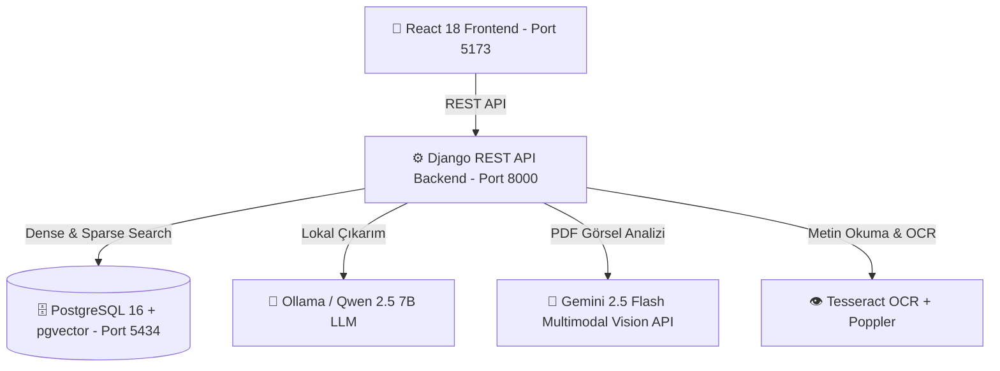

# 🚀 AKTAP TOFAŞ Mühendislik & Katalog Yapay Zeka Asistanı


**AKTAP Chatbot**, TOFAŞ otomotiv mühendislik standartları, kalıp yapım şartnameleri, teknik çizimler, parça katalogları ve veritabanı kayıtları üzerinde hibrit RAG (Retrieval-Augmented Generation), yerel LLM ve Multimodal Yapay Zeka teknolojilerini kullanarak %100 doğrulukla yanıt üreten gelişmiş bir mühendislik asistanıdır.

---

## ⚡ 1. Hızlı Başlangıç (Docker ile Tek Tıkla Çalıştırma)

Projeyi kendi bilgisayarınızda sıfır konfigürasyon ile tek tıkla çalıştırmak için:

1. Bilgisayarınızda **Docker Desktop** uygulamasının açık ve çalışır durumda olduğundan emin olun.
2. Proje dizinindeki **[`docker_baslat.bat`](file:///c:/Users/ogikk/OneDrive/Desktop/chatbot_project28.07.2026/docker_baslat.bat)** dosyasına çift tıklayın.
3. Konteynerler derlendikten sonra tarayıcınızda otomatik olarak **`http://localhost:5173`** adresi açılacaktır.

---

## 🏗️ 2. Mimari ve Teknoloji Yığını (Tech Stack)

Sistem 3 ana katmandan oluşan mikroservis benzeri konteyner mimarisine sahiptir:



### 💻 Frontend (Kullanıcı Arayüzü)
- **Framework:** React 18 + Vite (Süper hızlı hot-reload ve optimize build)
- **Stil & Arayüz:** Modern dark mode destekli responsive tasarım, dinamik sohbet akışı, dosya yükleme ve görsel önizleme panelleri.
- **Port:** `5173`

### ⚙️ Backend (Sunucu & API)
- **Framework:** Python 3.11, Django 4.x, Django REST Framework (DRF)
- **Cross-Origin:** `django-cors-headers`
- **Port:** `8000`

### 🗄️ Veritabanı & Vektör Havuzu (Database & Vector Store)
- **PostgreSQL 16 + pgvector (Ana Veritabanı):** Tüm TOFAŞ katalog verileri, sohbet geçmişi, kullanıcı dokümanları ve 384-boyutlu vektör gömme (embedding) verileri PostgreSQL üzerinde saklanır.
- **SQLite (`mudb.db`):** İlk geliştirme aşamasındaki ham veritabanıdır; veriler `scripts/create_tofas_db.py` betiği ile PostgreSQL'e aktarılmıştır.
- **Port:** `5434` (PostgreSQL)

---

## 💡 3. Ana Özellikler ve Yetenekler

### 🧠 1. Hibrit RAG (Retrieval-Augmented Generation) & RRF
Sadece vektör araması yapmak yerine, bilgi getirme doğruluğunu %95+'ya çıkarmak için hibrit arama mimarisi kullanılmıştır:
- **Dense Search (Yoğun Arama):** `paraphrase-multilingual-MiniLM-L12-v2` modeli ile üretilen 384 boyutlu vektörlerin `pgvector` üzerinde Cosine Similarity araması.
- **Sparse Search (Seyrek Arama):** BM25 algoritması ile dokümanlar içerisindeki teknik terim, parça kodu ve anahtar kelime araması.
- **Reciprocal Rank Fusion (RRF):** Her iki arama sonucunu puanlayıp birleştirerek en alakalı metin parçalarını LLM'e bağlam (context) olarak iletir.

### 🤖 2. Çift LLM Motoru Desteği (Yerel & Bulut)
- **Yerel LLM (Ollama - Qwen 2.5 7B):** Gizli mühendislik verilerinin dışarı çıkmaması için internet gerektirmeyen %100 yerel çıkarım.
- **Gemini 2.5 Flash Vision API:** Metin barındırmayan, sadece teknik çizim ve tolerans şemalarından oluşan PDF'leri görsel olarak analiz edip mühendislik açıklamalarına dönüştürme.

### 👁️ 3. Tesseract OCR ve Çoklu Doküman İşleme
- Metin içerikli PDF, DOCX, XLSX ve TXT dosyalarının ayrıştırılması.
- **Tesseract OCR (Türkçe + İngilizce):** Taranmış PDF sayfalarının ve fotoğrafların `pdf2image` vasıtasıyla OCR işleminden geçirilip RAG havuzuna eklenmesi.

### 🧹 4. Otomatik Disk & Dosya Yönetimi (Cleanup Signals)
- Kullanıcı bir sohbeti veya yüklediği dokümanı sildiğinde, Django `@receiver(post_delete)` sinyali tetiklenerek diskteki fiziksel PDF/Word dosyaları otomatik silinir ve disk doluluğu engellenir.
- **Global Doküman İzolasyonu:** Sabit şirket dokümanları (`global_documents/`) kullanıcı işlemlerinden tamamen izole edilmiştir.

---

## 🛠️ 4. Manuel Kurulum ve Komutlar

### Docker Compose ile Çalıştırma:
```bash
docker compose up -d --build
```

### Docker Servislerini Durdurma:
```bash
docker compose down
```

### PDF Teknik Şema Analizi Komutu (Gemini Multimodal):
```bash
python manage.py analyze_pdf_gemini --pdf ./global_documents/TOFAS_KALIP_YAPIM_ŞARTNAMESİ.pdf
```

---

## 📁 5. Proje Klasör Yapısı

```text
chatbot_project/
├── apps/                    # Django Uygulama Modülleri
│   ├── chat/                # Sohbet geçmişi ve oturum yönetimi
│   ├── documents/           # Doküman yükleme ve OCR işlemleri
│   ├── mudb_data/           # TOFAŞ veritabanı ve katalog modelleri
│   ├── prompts/             # Sistem promptları yönetimi
│   └── rag/                 # RAG motoru, chunker, retriever ve rewriter
├── config/                  # Django proje ayarları (settings, urls)
├── frontend_react/          # React 18 & Vite kullanıcı arayüzü
├── global_documents/        # Sabit TOFAŞ teknik şartnameleri ve PDF'ler
├── scripts/                 # Otomatik veritabanı taşıma ve aktarım betikleri
├── Dockerfile               # Backend Docker yapılandırması
├── docker-compose.yml       # 3'lü konteyner (db, backend, frontend) orchestration
├── docker_baslat.bat        # Gözetmen için tek tıkla Docker başlatıcı
├── start.bat                # Hafif yerel Django başlatıcı
└── README.md                # Proje dokümantasyonu
```

---

## 🛡️ Lisans ve Gizlilik
Bu proje TOFAŞ Mühendislik ve Katalog verileriyle uyumlu çalışacak şekilde tasarlanmıştır.
